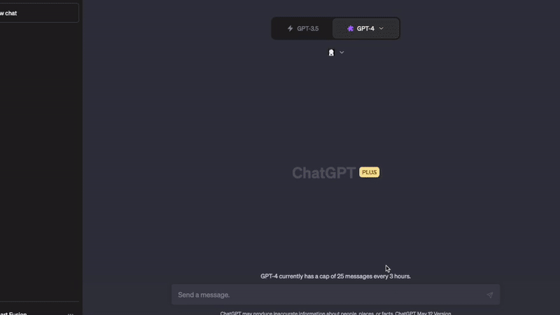

PROTOTYPE !!! v_0.0.3

---

# 🚀 Reactor Plugin for ChatGPT 🚀

Welcome to the future of web development! Reactor is a cutting-edge plugin for OpenAI's ChatGPT that's here to revolutionize the way you create web applications.




## 🎯 What is it?

Reactor takes your ideas and turns them into reality. Simply describe the web application you want to create, and Reactor will generate the code for you. But that's not all! It also provides a screenshot of the resulting web application, giving you a sneak peek of your idea brought to life.


## 🌟 Features

- **Code Generation**: Reactor isn't just any code generator. It's your personal web development assistant. From simple websites to complex web apps, Reactor has got you covered.

- **Screenshot Generation**: A picture is worth a thousand words, and Reactor knows it. Along with the code, it gives you a visual representation of the generated web application.


## 🚀 How to Use

Unleash the power of Reactor with a simple JSON prompt. Describe the web application you want, and Reactor will do the rest.

```

  Create a website for  "  ...  ".

```


## ⚠️ Limitations

Reactor is currently in development. But who knows what the future holds? Stay tuned for updates!
If you do not already have plugin developer access, please [join the waitlist](https://openai.com/waitlist/plugins).


## 🙌 Contribute

Reactor is open to contributions! If you have ideas to make it even better, don't hesitate to fork the repository and submit a pull request.


## Project Overview

It's designed to receive a user's desired feature or change for a React codebase and returns the updated code along with a screenshot of the rendered application.


## Getting Started

To get a local copy up and running, follow these steps.


### Prerequisites

- Node.js and npm: You can download these from [here](https://nodejs.org/en/download/).
- Python: You can download it from [here](https://www.python.org/downloads/).
- Pip: You can download it from [here](https://pip.pypa.io/en/stable/installation/).
- Quart and quart-cors: Install them using pip.


### Installation

1. Clone the repository
```bash
git clone https://github.com/admineral/Reactor-ChatGPT-Plugin.git
```
2. Install Node packages
```bash
npm install
```
3. Install Python packages
```bash
pip install -r requirements.txt
```


### Running the Application

1. Start the Express server
```bash
node server.js
```
2. Start the Quart server
```bash
python main.py
```


## Acknowledgments


- Node.js and Express for providing the backend framework.
- Puppeteer for providing the headless browser functionality.


# requirements.txt

```txt
quart
quart-cors
requests
```
Once the local server is running:

1. Navigate to https://chat.openai.com. 
2. In the Model drop down, select "Plugins" (note, if you don't see it there, you don't have access yet).
3. Select "Plugin store"
4. Select "Develop your own plugin"
5. Enter in `localhost:5003` since this is the URL the server is running on locally, then select "Find manifest file".

The plugin should now be installed and enabled! You can start with a question like "What is on my todo list" and then try adding something to it as well! 


## Getting help

If you run into issues or have questions building a plugin, please join our [Developer community forum](https://community.openai.com/c/chat-plugins/20).


